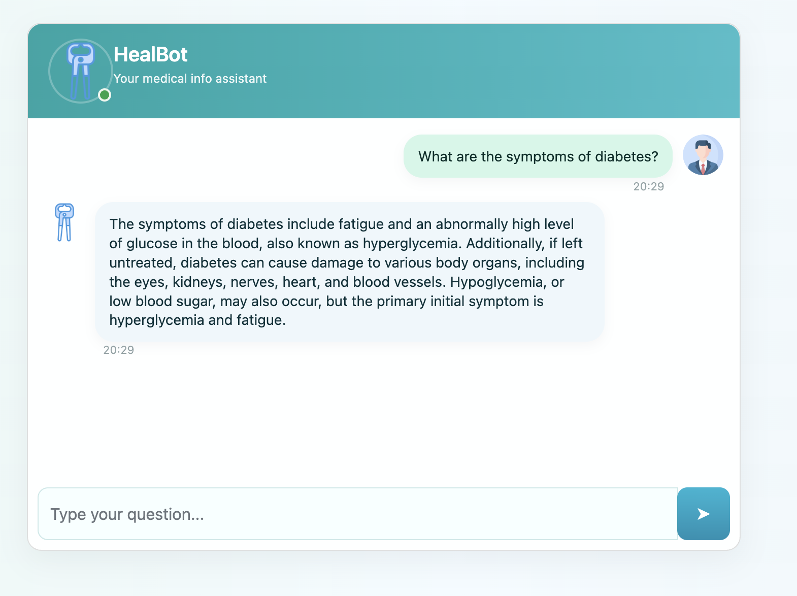
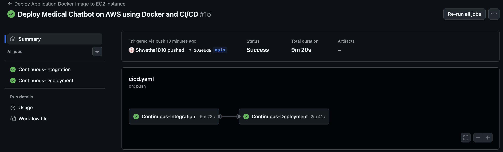
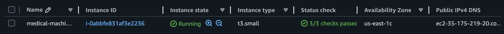

# HealBot: AI-Powered Medical Assistant

A production-ready Retrieval-Augmented Generation (RAG) application that enables users to ask medical questions and receive context-aware responses grounded in trusted medical documents.

Built using LangChain, Pinecone, Groq Llama 3.3 70B, Flask, Docker, AWS, and GitHub Actions.

---

## Features

* Retrieval-Augmented Generation (RAG) based medical question answering
* Semantic search using vector embeddings
* Context-aware response generation with Llama 3.3 70B
* Pinecone-powered vector database retrieval
* Interactive Flask-based chatbot interface
* Docker containerization for portability and scalability
* AWS deployment using EC2 and Amazon ECR
* Automated CI/CD pipeline using GitHub Actions

---

## Tech Stack

| Category         | Technologies                             |
| ---------------- | ---------------------------------------- |
| LLM              | Groq Llama 3.3 70B                       |
| Framework        | LangChain                                |
| Vector Database  | Pinecone                                 |
| Embeddings       | Sentence Transformers (all-MiniLM-L6-v2) |
| Backend          | Flask, Python                            |
| Containerization | Docker                                   |
| Cloud            | AWS EC2, Amazon ECR                      |
| DevOps           | GitHub Actions CI/CD                     |

---

## Architecture

```text
User Query
    │
    ▼
Flask Application
    │
    ▼
Embedding Generation
    │
    ▼
Pinecone Vector Search
    │
    ▼
Relevant Medical Context
    │
    ▼
Groq Llama 3.3 70B
    │
    ▼
Generated Response
```

---

## Deployment Pipeline

```text
GitHub Repository
        │
        ▼
GitHub Actions
        │
        ▼
Docker Image Build
        │
        ▼
Amazon ECR
        │
        ▼
AWS EC2 Deployment
        │
        ▼
Live Application
```


---

## Screenshots


### HealBot Medical Assistant Interface

The deployed medical chatbot powered by Retrieval-Augmented Generation (RAG), capable of answering healthcare-related queries using context retrieved from a medical knowledge base.



---

### Automated CI/CD Pipeline

GitHub Actions workflow that automatically builds the Docker image, pushes it to Amazon Elastic Container Registry (ECR), and deploys the latest application version to AWS infrastructure.



---

### AWS Cloud Deployment

Production deployment of the containerized application on Amazon EC2 using Docker, integrated with Amazon ECR for image management and automated delivery through GitHub Actions.



---


